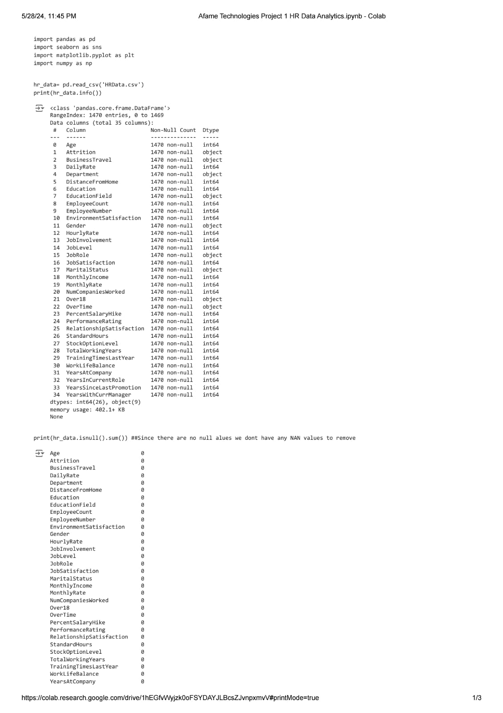
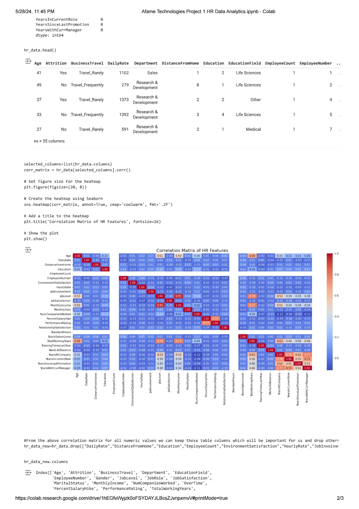
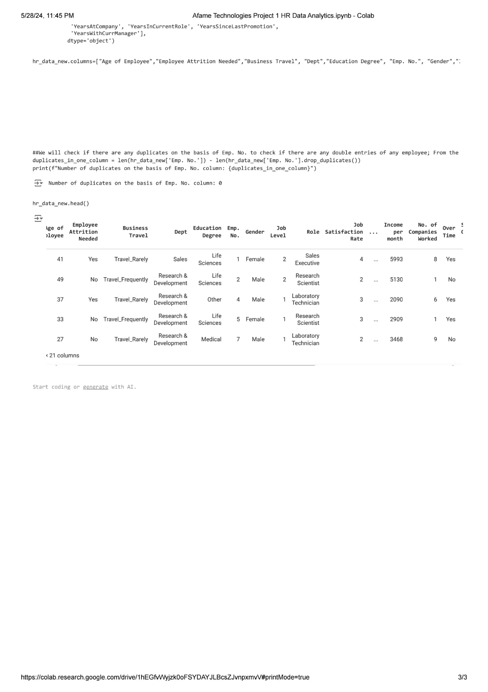

# Afame-Technologies
Project 1
# HR Data Analysis Project

## Introduction
This project involves a comprehensive data cleansing process for an HR dataset. The goal is to prepare the data for effective analysis by removing irrelevant information, handling missing values, eliminating redundancies, and making other necessary adjustments. This process ensures the dataset is clean, consistent, and ready for further analysis or modeling.

## Data Cleansing Steps
### 1. Remove Unnecessary Columns
Identify and remove columns that are not useful for analysis.
### 2. Rename Columns
Give columns meaningful names to enhance readability and understanding.
### 3. Eliminate Redundant Entries
Remove duplicate rows to ensure unique entries.
### 4. Eliminate NaN Values
Address NaN values by either dropping or filling them with appropriate values.
### 5. Additional Changes
- Handle outliers
- Standardize/Normalize numerical columns

## Repository Structure

- **data/**
  - `hr_data.csv`: Original dataset
  - `cleaned_hr_data.csv`: Cleaned dataset

## Conclusion

By following these data cleansing steps, the HR dataset is now clean, consistent, and ready for detailed analysis. This preparation is essential for accurate and reliable insights, which can significantly impact HR decision-making processes.
